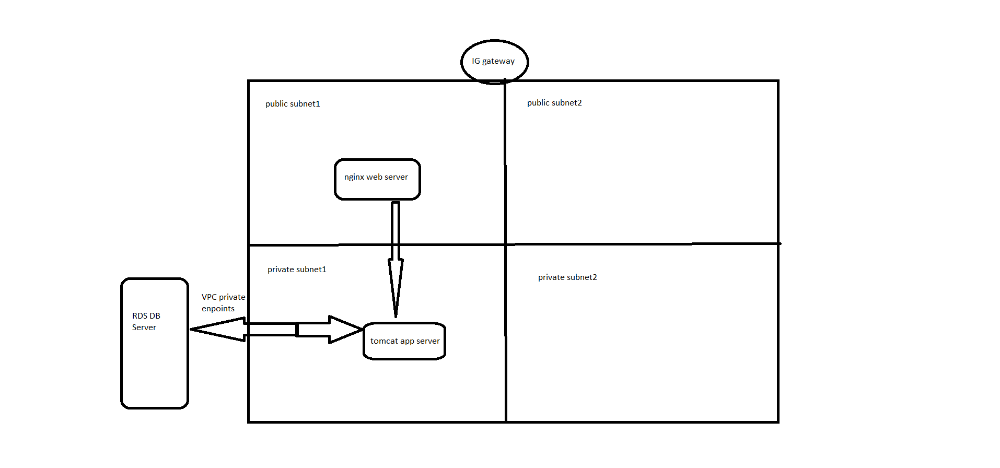

# BASE_ARCHITECTURE

The above diagram explains the architecture whichhas been used to create the base infra for aws.

The web server (nginx) is created in public subnet to have a communication with internet.
The app server (tomcat) and DB server is created in private subnet as we don't want to expose it externally.

Base VPC and Security groups have been defined in vpc.tf to establish the connection and control traffic.

## Improvements
* For scalability we can use autoscaling groups.
* We can put out static contents in S3 buckets.
* We can use ALB in public subnet to distribute the traffic.
* We might have to create DNS records for the application URLs.
